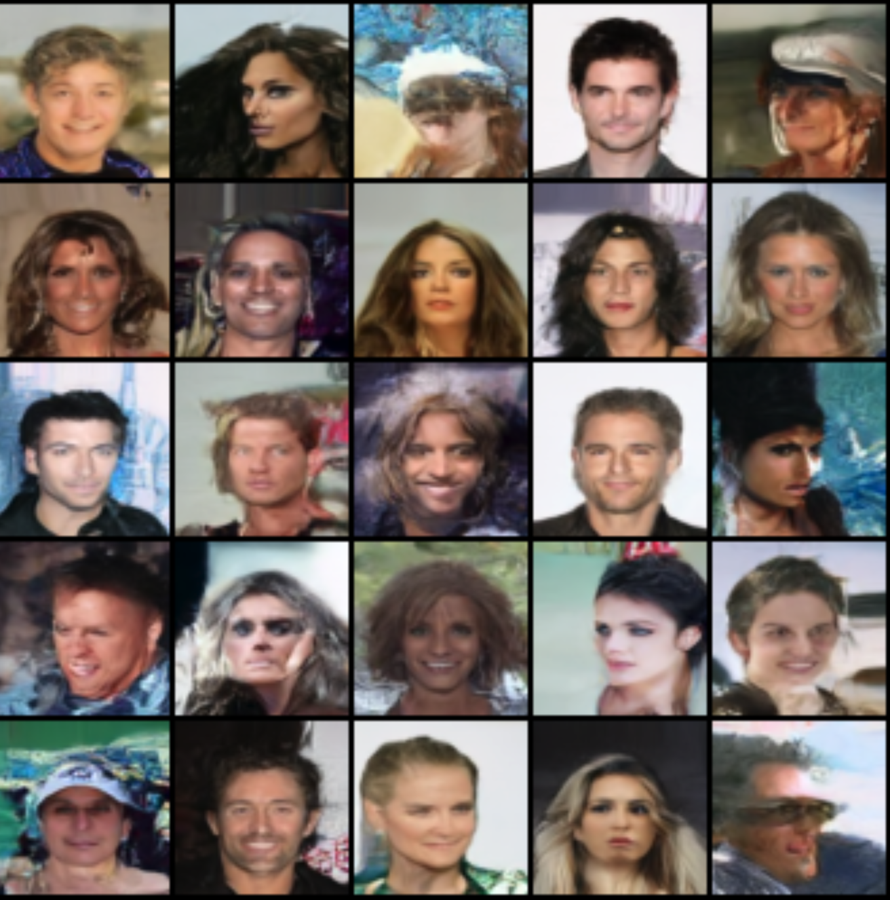

# Diffusion Model

This contains my implementation of a stable diffusion model.

# Training details
* Dataset: CelebA
* train/test split: 90/10
* image size: 64x64
* batch size: 8
* GPU: GeForce RTX 2080 Ti, 12GB

|  | 
|:--:| 
| *Inference after 30 epochs* |

